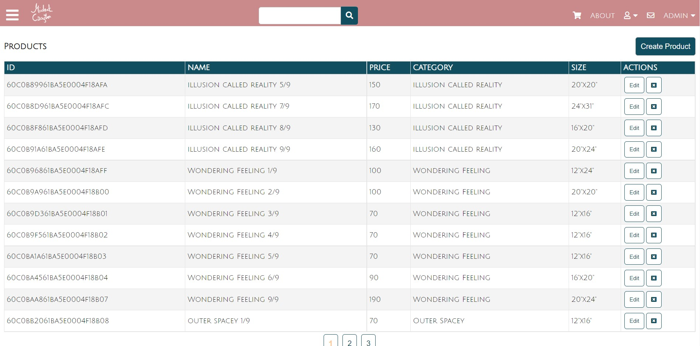

# EMSIART
## M.E.R.N Stack Ecommerce Site with Admin panel for C.R.U.D functionality

A M.E.R.N Stack Ecommerce Project for an Artist Gallery with admin side login for updating products, users and orders withuse of Google charts for displaying live shop data.

## Features 

- Responsive fast Frontend using React
- Sign in and Sign out
- contact us usign Formsubmit
- PayPal integration for payment  
- Mailgun to handle automatic recipt email
- Google charts for displaying live shop data
- C.R.U.D functionaly to update data base within Admin panel
- MongoDB to handle the storage of shop data
- AWS s3 for cloud storage for storing our images 
- Heroku for deployment
- Redux store for handling state within the project
- Node & Express for Web API, File Upload, JWT

# Admin Side

## Products Page

