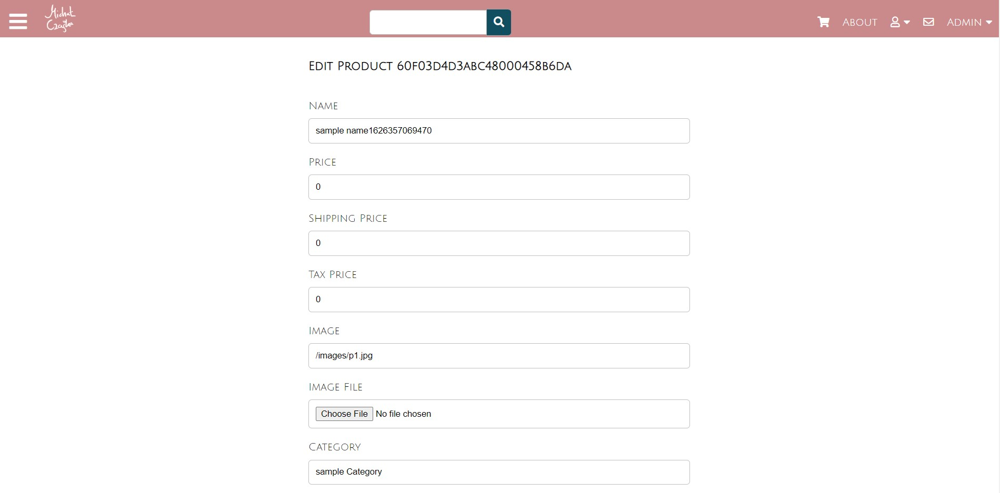
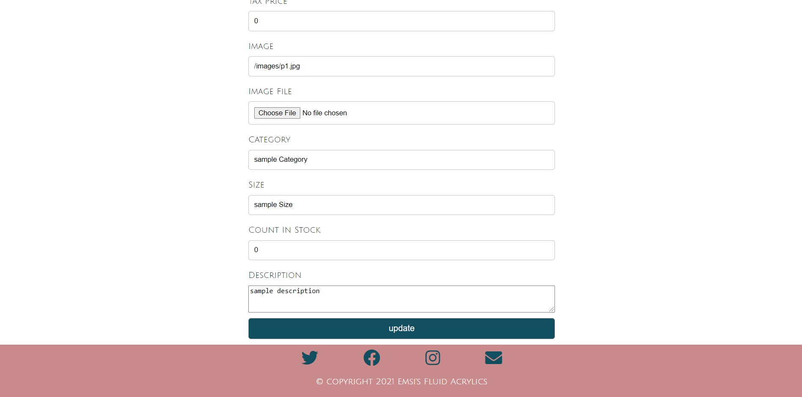
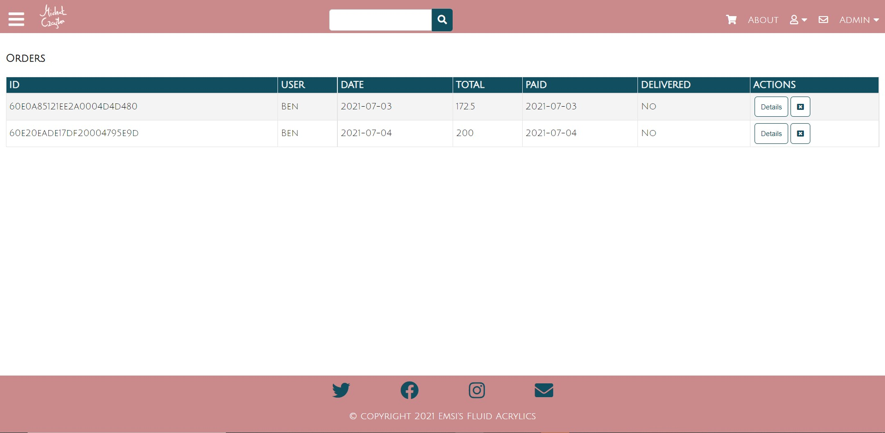
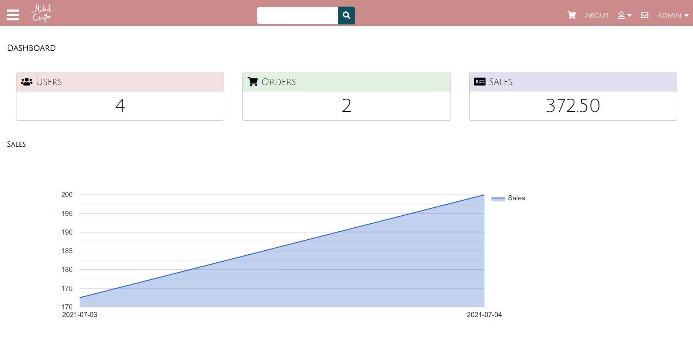
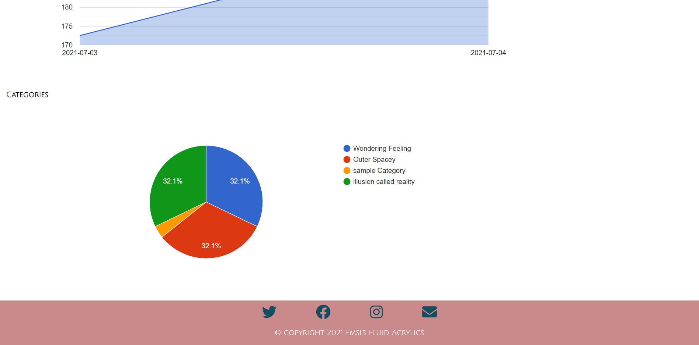
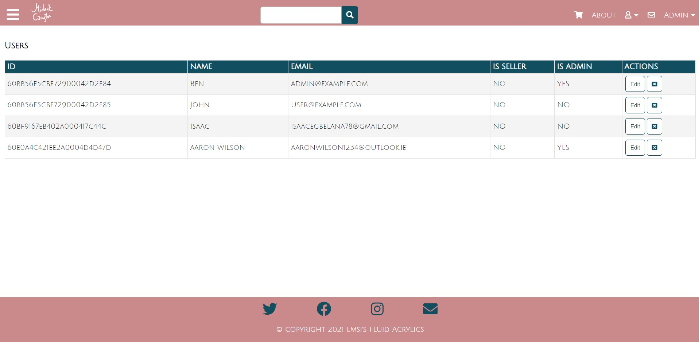

# EMSIART
## M.E.R.N Stack Ecommerce Site with Admin panel for C.R.U.D functionality

A M.E.R.N Stack Ecommerce Project for an Artist Gallery with admin side login for updating products, users and orders withuse of Google charts for displaying live shop data.

## Features 

- Responsive fast Frontend using React
- Sign in and Sign out
- contact us usign Formsubmit
- PayPal integration for payment  
- Mailgun to handle automatic recipt email
- Google charts for displaying live shop data
- C.R.U.D functionaly to update data base within Admin panel
- MongoDB to handle the storage of shop data
- AWS s3 for cloud storage for storing our images 
- Heroku for deployment
- Redux store for handling state within the project
- Node & Express for Web API, File Upload, JWT

# Admin Side

## Products Page

Products page listing all of our items attributes such ass canvas size, price, name and id. 
both options to create and delete items through the site are available.

## Edit Product Page

Edit products page with multiple editable attributes for each item including image upload.
all images are uploaded to an AWS s3 database for storage, the image input gets filled with aws path once item is selected for upload.

## Orders Page

Orders page dipicting live order data including status of delivery and payment, also tracking date of completion.
by clicking on details the admin can also update the value of delivery.

## Dashboard

Dashboard for tracking our shop data such as number of users, sales and categories.

## Users Page

Users page for editing user details such as isAdmin.

